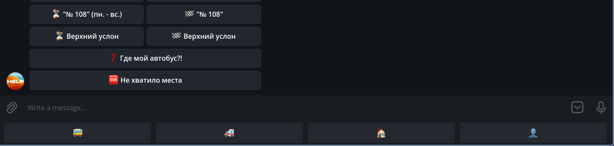

# inno-camp-bot

Legend: A group of children - participants come to a full-time shift up to 4 days long [schedule shouldn't have that limit]. The group has the same schedule for everyone (the schedule includes meals, training sessions at the UI, excursions, evenings, etc.) The group has accompanying persons. Accompanying may have a separate schedule. The group has a curator from UI - the owner of the bot. The group has a general chat in the TG. The group has teachers.

- The participant can request his schedule for a specific day.
- The participant can request his schedule for the current (next) activity.
- The escort can request their schedule and the participant's schedule for a specific day.
- The attendant can request his schedule and the participant's schedule for the current (next) activity.
- Together with the answer on the current (next) activity, the participant and the accompanying person can find out the location of the audience in which the lesson will be held
- The participant can request homework for the next day.
- The teacher can upload homework.
- The curator can upload the schedule with audience numbers.
- The curator can download the list of participants, accompanying, teachers.


# TODO:
All time should be GMT+3 \
Create a separate file for each task

- [ ] [Schedule class](#schedule)
- [ ] [Homeworks class](#homeworks)
- [ ] [Group class](#group) [taken]
- [ ] [Inline keyboard base](#inline-keyboard-base)
- [ ] [Messages](#messages)

## Schedule

Create a schedule class that contains information about each activity.
Required functions:
**Parse(String input)** - returns a Schedule with all activities

**Activity_next()** - return string, next activity based on current date/time

**Activity_day(String day)** - return string, get all activities in a day

**Activity_all()** - return string, all activities

*Input file format:*
```
Date(MM-DD-YYYY) | Time(HH:mm) | Activity | Place
```
Example:
```
06-07-2021 | 22:46 | Study | room 108
```

*Output example:* (for activity_all())
```
Date (DD month_name) 
HH:mm | First_activity | Place
HH:mm | Second_activity | Place
Other_Date (DD month_name) 
HH:mm | Other_activity | Place
```

## Homeworks

Homeworks class that contains entries with date and homework text \
**Functions:** \
**upload()** - appends homework to the list, overwrites the entires for the dates that already exist. \
**get_tomorrow()** - return string with homework for tomorrow \
**get_all()** - return string with all existing homeworks

**Input format:**
```
MM-DD-YYYY | Hw text
```

**Output format:**
```
DD month_name | Hw text
```

## Group
**Group class consists of members:**\
pupils: Array\
accompanying: Array\
Teachers: Array\
Schedule\
Homeworks

*Functions:*\
**Parse_members(String input)** - sets pupils etc \
*Format* (separator is space):
```
first line has all pupils (ex: nickname1 second_nick)
second line has all accompanying
third line has all teachers
```

**find_member(String nickname)** - returns member type ("pupil", "accompanying", "teacher", "none")

## Inline keyboard base

Come up with a best way to display buttons for each user
and implement the code(only for the keyboard itself).\
Example: 

You can make use of both inline (in-chat) keyboard and keyboard under the message prompt.
Structure for pupil:
```
Schedule
├── Now  -> reply
├── Day  -> reply
└── All  -> reply
Homework -> reply
```
Check [the sheet](#inno-camp-bot) for other members.

## Messages
Read [this](#inno-camp-bot) and come up with messages for:\
**/start** - introduce to functionality (for each member type,
including member not found (it should redirect the user to CURATOR(global const string))).

Read other tasks and come up with messages that explain the input
format for schedule, homework.

Error message that redirects to CURATOR 

Put all these messages in const variables in a file


